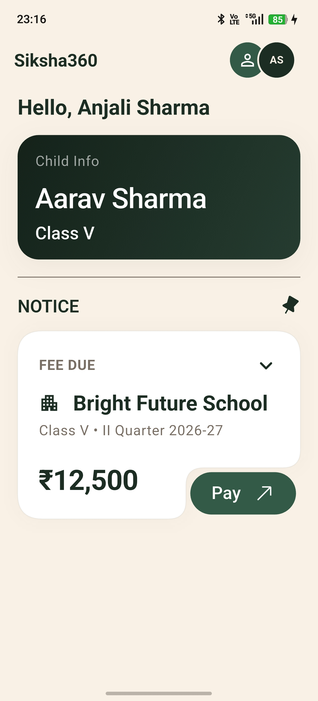
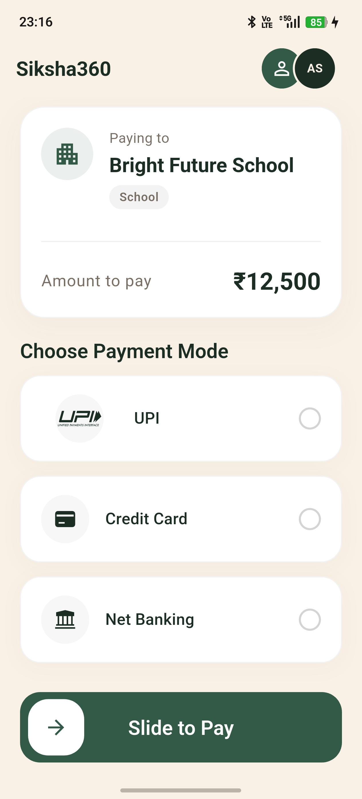
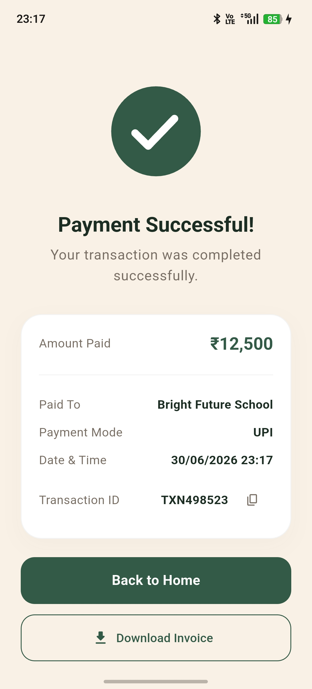
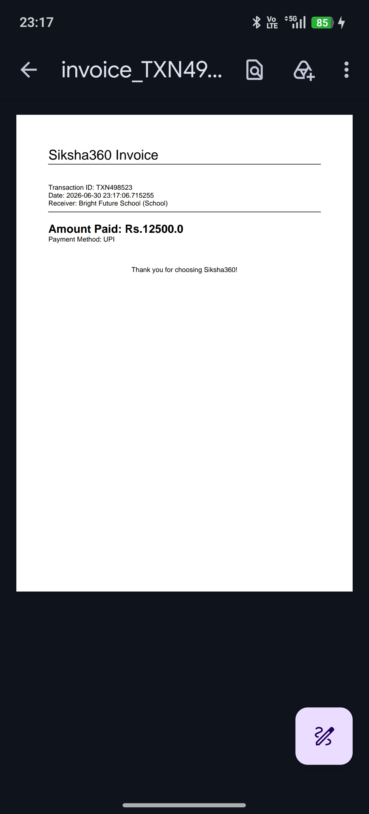

# Siksha360 - Fee Payment Flow

Siksha360 Fee Payment Flow is a Clean Architecture Flutter application designed for an educational fee checkout flow. It allows parents to view pending education fees and complete a simulated, mock fee payment flow utilizing Riverpod for state management and GoRouter for navigation.

---

## 🎨 UI/UX Reasoning

I designed this application to be easily operated with a single hand, keeping in mind that busy parents are often multitasking and might only have one hand free. By positioning the interactive elements like the main fee card and the "Slide to Pay" slider near the bottom of the screen, I ensured they sit comfortably within natural thumb reach.

Knowing that parents prefer a clean, focused environment when managing finances, I chose a simple, clutter free layout over a loud or busy design. The soothing, premium green and cream color palette is easy on the eyes and brings a sense of calm and stability to the payment process.

Additionally, I integrated a "Slide to Pay" slider instead of a standard tap button. This physical swipe gesture acts as a safety guard, preventing accidental payments from a child playing with the phone or a parent's unintended misclick.

---

## 🛠️ Tech Stack Used

- **Framework**: [Flutter](https://flutter.dev/) (Dart)
- **State Management**: [Riverpod (flutter_riverpod)](https://riverpod.dev/) with [Riverpod Generator](https://pub.dev/packages/riverpod_generator) (Code Generation)
- **Routing**: [GoRouter (go_router)](https://pub.dev/packages/go_router)
- **Animations**: [Lottie (lottie)](https://pub.dev/packages/lottie), [SlideToAct (slide_to_act)](https://pub.dev/packages/slide_to_act) (Slide to Pay)
- **Local/Mock Data**: Local mock data load using `rootBundle.loadString()` from assets JSON.
- **Icons & Assets**: Custom SVG icons colored dynamically using Flutter's `ColorFilter.mode(..., BlendMode.srcIn)`.

---

## 📸 Screenshots

| Home Screen | Payment Screen | Payment Success Screen | Generated Invoice |
| :---: | :---: | :---: | :---: |
|  |  |  |  |

---

## 🔗 Demo Link

- **Video Demo**: [Click to watch demo](https://drive.google.com/file/d/1d5H74SknGbhQ4JB3FjbOSSvjQFxVb-hE/view?usp=sharing)
- **APK Download**: [Click to download apk](https://github.com/GalaxyPhoenix716/Siksha360-PaymentFlow/releases/tag/v0.1.0-alpha)

---

## 📂 Project Structure

This project follows a **Feature-First Clean Architecture** structure combined with **Riverpod** for state management:

```
lib/
├── core/                        # Shared/cross-cutting concerns
│   ├── constants/               # Global configuration constants
│   │   ├── colors.dart          # Unified color themes
│   │   └── route_names.dart     # GoRouter navigation route keys
│   ├── error/                   # Failure and Exception handling classes
│   │   └── failures.dart
│   ├── routing/                 # GoRouter navigation setup and route definitions
│   │   └── app_routes_config.dart
│   ├── theme/                   # App styling, themes, colors, typography
│   │   ├── app_text_theme.dart
│   │   └── app_theme.dart
│   └── utils/                   # Shared utility classes
│       └── utils.dart           # NumberFormatter and DateTimeFormatter
│
├── features/                    # Feature modules (Domain-driven)
│   ├── home/                    # Home screen & Fee payment card overview
│   │   ├── data/                # Data layer: Remote datasource & Models
│   │   │   ├── datasources/
│   │   │   │   └── home_remote_datasource.dart
│   │   │   ├── models/
│   │   │   │   ├── parent_model.dart
│   │   │   │   ├── student_fee_model.dart
│   │   │   │   └── user_model.dart
│   │   │   └── repositories/
│   │   │       └── home_repository_impl.dart
│   │   ├── domain/              # Domain layer (Business contracts & Usecases)
│   │   │   ├── entities/
│   │   │   │   ├── parent.dart
│   │   │   │   └── student_fee.dart
│   │   │   ├── repositories/
│   │   │   │   └── home_repository.dart
│   │   │   └── usecases/
│   │   │       └── fetch_user.dart
│   │   └── presentation/        # Presentation layer: UI, widgets & Riverpod state
│   │       ├── providers/
│   │       │   ├── home_provider.dart
│   │       │   └── home_provider.g.dart
│   │       ├── screens/
│   │       │   └── home_page.dart
│   │       └── widgets/
│   │           ├── child_info_card.dart
│   │           └── fee_card.dart
│   │
│   └── payment/                 # Payment details & success confirmation flow
│       ├── data/
│       │   ├── models/
│       │   │   └── payment_transaction_model.dart
│       │   └── repositories/
│       │       ├── invoice_repository_impl.dart
│       │       └── payment_repository_impl.dart
│       ├── domain/
│       │   ├── entities/
│       │   │   ├── payment_method.dart
│       │   │   └── payment_transaction.dart
│       │   ├── repositories/
│       │   │   ├── invoice_repository.dart
│       │   │   └── payment_repository.dart
│       │   └── usecases/
│       │       ├── generate_invoice.dart
│       │       └── process_payment.dart
│       └── presentation/
│           ├── providers/
│           │   ├── payment_provider.dart
│           │   ├── payment_provider.g.dart
│           │   └── payment_state.dart
│           ├── screens/
│           │   ├── payment_completed_page.dart
│           │   └── payment_page.dart
│           └── widgets/
│               ├── fee_summary_card.dart
│               ├── payment_mode_selector.dart
│               ├── payment_summary.dart
│               └── slide_to_pay.dart
│
├── shared/                      # Global common widgets shared across features
│   └── siksha_appbar.dart
│
└── main.dart                    # Application entry point
```

### Architectural Layers Explained

1. **Domain Layer**: The core business logic. It contains **Entities** (business objects like `StudentFee` and `Parent`), **Repository Interfaces** (data access contracts), and **Usecases** (encapsulated business logic tasks like `FetchUserUseCase`). This layer is completely independent of Flutter, UI frameworks, or external databases.
2. **Data Layer**: The implementation of data access. Contains **Models** (data structures that extend Entities and add serialization/deserialization logic), **Datasources** (local JSON loading), and **Repository Implementations** (concrete classes fulfilling the domain repository contracts).
3. **Presentation Layer**: UI and state management. Contains **Screens/Pages** (views), **Widgets** (reusable UI elements), and **Providers/Controllers** (Riverpod providers managing UI state and interacting with Domain Usecases).

---

## ⚙️ Setup Steps

Follow these steps to set up and run the application locally:

### Prerequisites

- [Flutter SDK](https://docs.flutter.dev/get-started/install) (Ensure you are on a stable channel)
- Dart SDK
- Android SDK / Xcode (for running on emulators/simulators)

### Installation

1. **Clone the repository:**

   ```bash
   git clone git@github.com:GalaxyPhoenix716/Siksha360-PaymentFlow.git
   cd siksha360_task
   ```

2. **Install dependencies:**

   ```bash
   flutter pub get
   ```

3. **Verify analyzer & build:**

   ```bash
   flutter analyze
   ```

4. **Run the application:**
   - For Android/iOS:
     ```bash
     flutter run
     ```
   - For Web:
     ```bash
     flutter run -d chrome
     ```

---

## ⚠️ Important Topics & Considerations

- **Mock Data Handling**: The application relies entirely on mock local data loaded from `assets/mockData.json`.
- **Strict Lint Rules**: Built under standard Flutter lints to ensure clean, readable, and consistent code guidelines.
